# Préambule

Tous les chemins spécifiés ici peuvent être modifiés à votre convenance. J'utiliserais ceux par défaut indiqués dans le fichier `compose.yml`. Veuillez en prendre connaissance et changer les chemins si nécessaire.

Téléchargez Docker pour le système sur lequel vous allez installer la solution en suivant leur guide https://docs.docker.com/engine/install/

NB : les clés d'API, secrets et autres qui sont montrés sur les captures ont été créées pour l'occasion et ne seront pas réutilisées.

NB2 : les liens que je donne sont basés sur localhost, évidemment si votre stack est hébergé sur un autre périphérique de votre réseau, remplacez par son IP.

# 0. Téléchargez et démarrer la stack

```
git clone https://github.com/soljian/arr-stack.git
cd arr-stack
docker compose up -d
```

# 1. Client VPN et killswitch

1. Modifier la variable d'environnement `WIREGUARD_PRIVATE_KEY` avec la clé privée de votre profil wireguard. Vous pouvez en trouver une sur Proton VPN. L'utilisation d'un abonnement premium est obligatoire lors de l'utilisation afin de pouvoir seed vos torrents aux autres utilisateurs. Le VPN sert a éviter d'exposer votre adresse IP (Hadopi). Si ce n'est pas un sujet pour vous, commentez/supprimez le service Gluetun et deluge-port-sync sur `compose.yml` puis supprimez le bloc `depends_on` du service `deluge`. Le killswitch inclus sur Gluetun permet d'empêcher Deluge de fonctionner dès lors que la connexion au VPN est impossible.

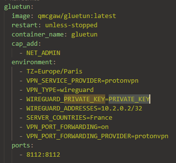

# 2. Client torrent

1. Se rendre sur http://localhost:8112 (mot de passe par défaut : `deluge`)

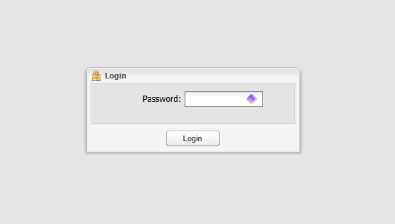

2. Ouvrir `Preferences` et configurer les chemins de téléchargement

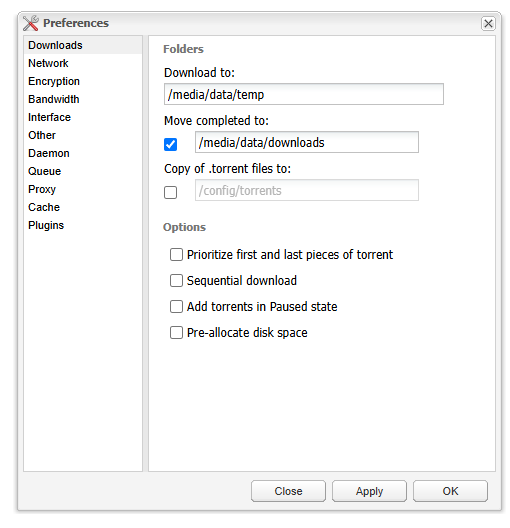

4. Activer le plugin/module `Label`

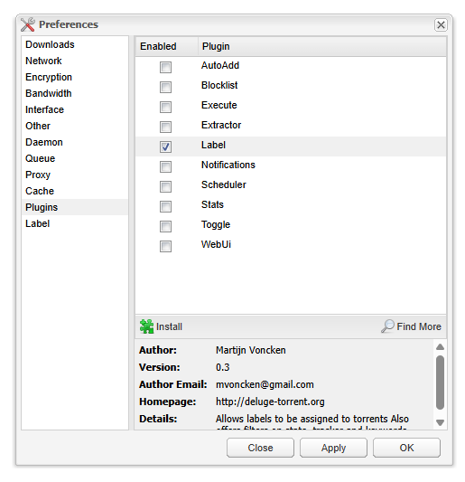

5. Modifier le mot de passe par défaut (rappel : `deluge`)

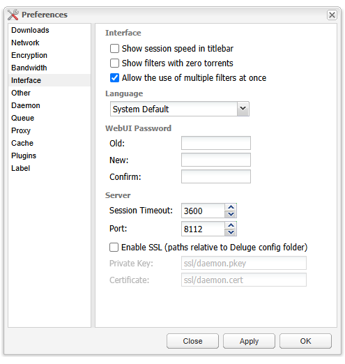

# 3. Prowlarr

1. Se rendre sur http://localhost:9696, activez l'authentification et créez votre compte

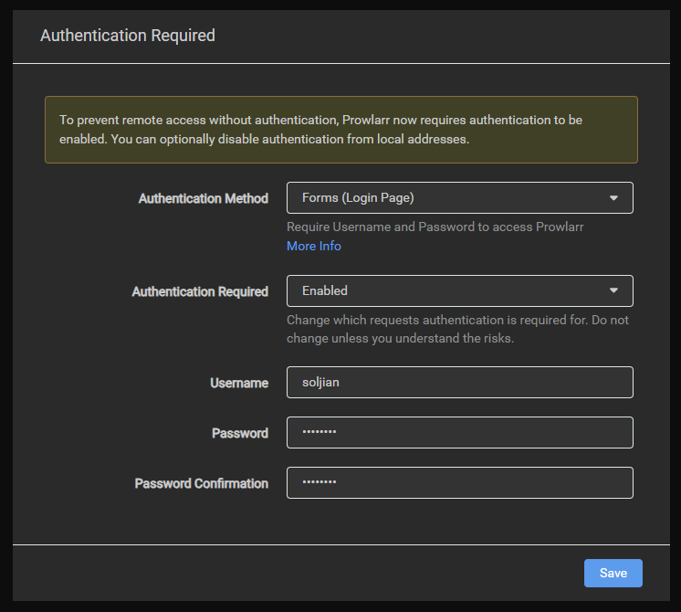

2. Se rendre sur `Indexers` puis `Add indexer`

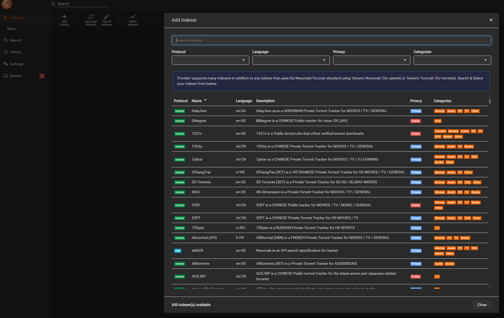

3. Choisissez votre indexer afin de sourcer vos fichiers torrent. Si vous avez un indexer privé tel que C411 ou consort, utilisez le et saisissez vos infos de connexion (Selon l'indexer la marche à suivre peut être légèrement différente, ça devrait être précisé sur la même page). Vous pouvez utiliser le bouton `Test` pour vérifier que tout est en ordre.

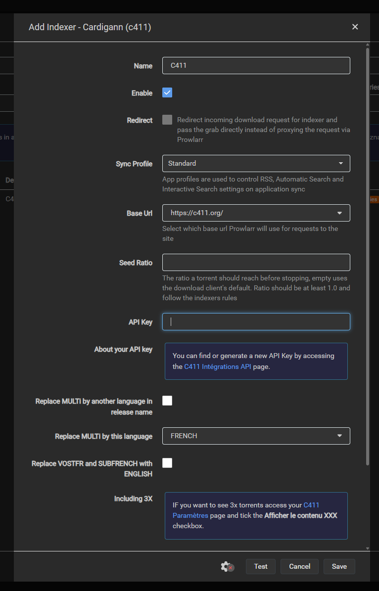

# 4. Sonarr

1. Se rendre sur http://localhost:8989 et configurez l'authentification de la même manière que pour Prowlarr.

2. Se rendre dans `Settings` puis `General`. Désactivez l'envoie des données anonymes et récupérez votre clé API.

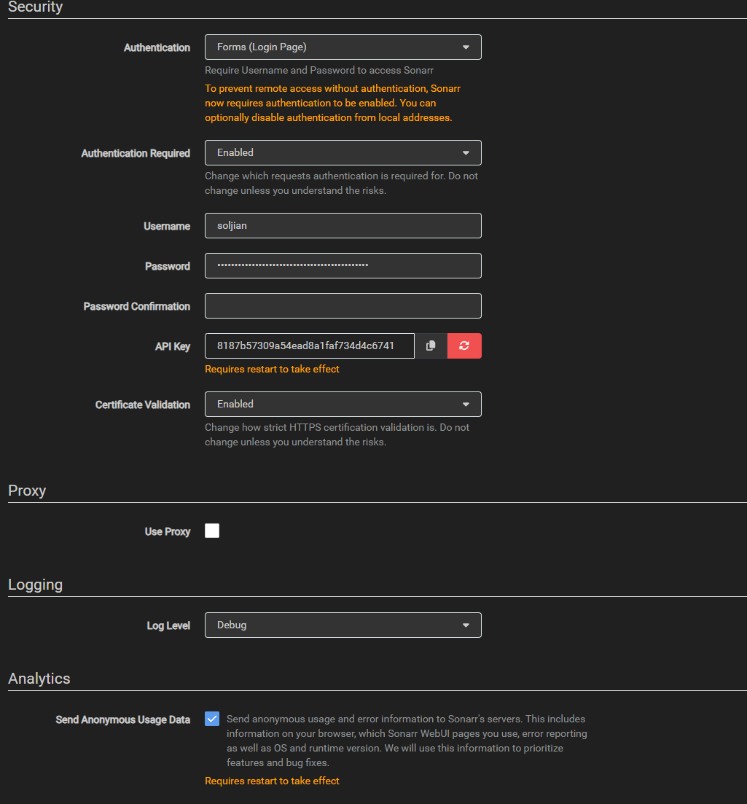

3. Sur Prowlarr, se rendre sur `Settings` puis `Apps`. Cliquez sur le bouton pour ajouter une application, sélectionnez `Sonarr`. Remplissez le formulaire comme sur la capture.

```
Prowlarr server: http://gluetun:9696
Sonarr server: http://sonarr:8989
API Key : votre clé API Sonarr
```

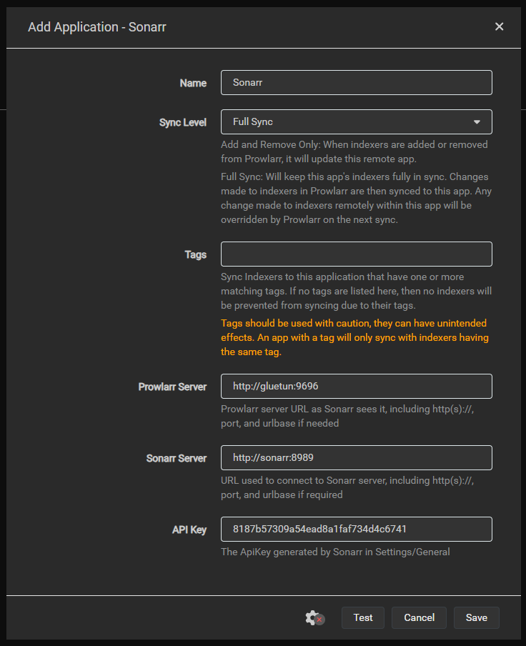

4. Sur Sonarr, sur la page `Settings` puis `Indexers`, vous devriez maintenant voir votre indexer configuré sur Prowlarr. Si ce n'est pas le cas, vérifiez les étapes précédentes.

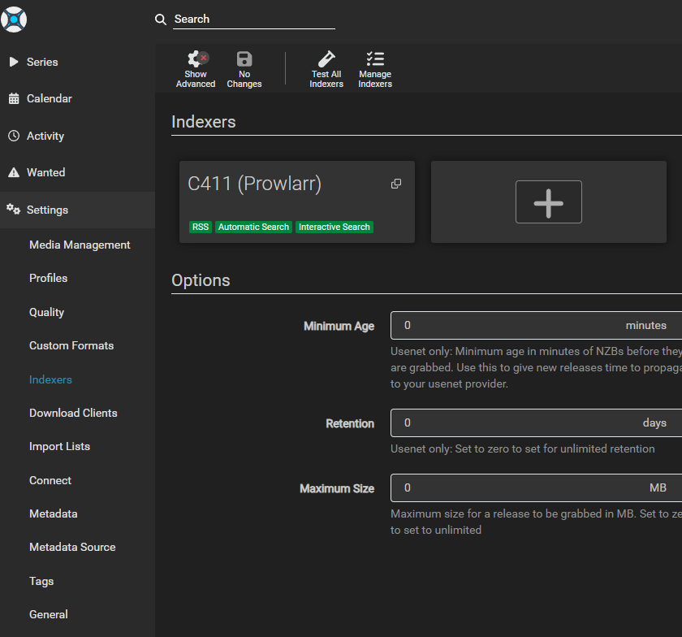

5. Se rendre sur `Settings` puis `Media Management`, puis configurez selon votre souhait. Je vous suggère la configuration suivante. Attention : n'oubliez pas la section `Root folders`, précisez bien le dossier où seront enregistrées vos séries. Si le dossier n'existe pas encore, créez le.

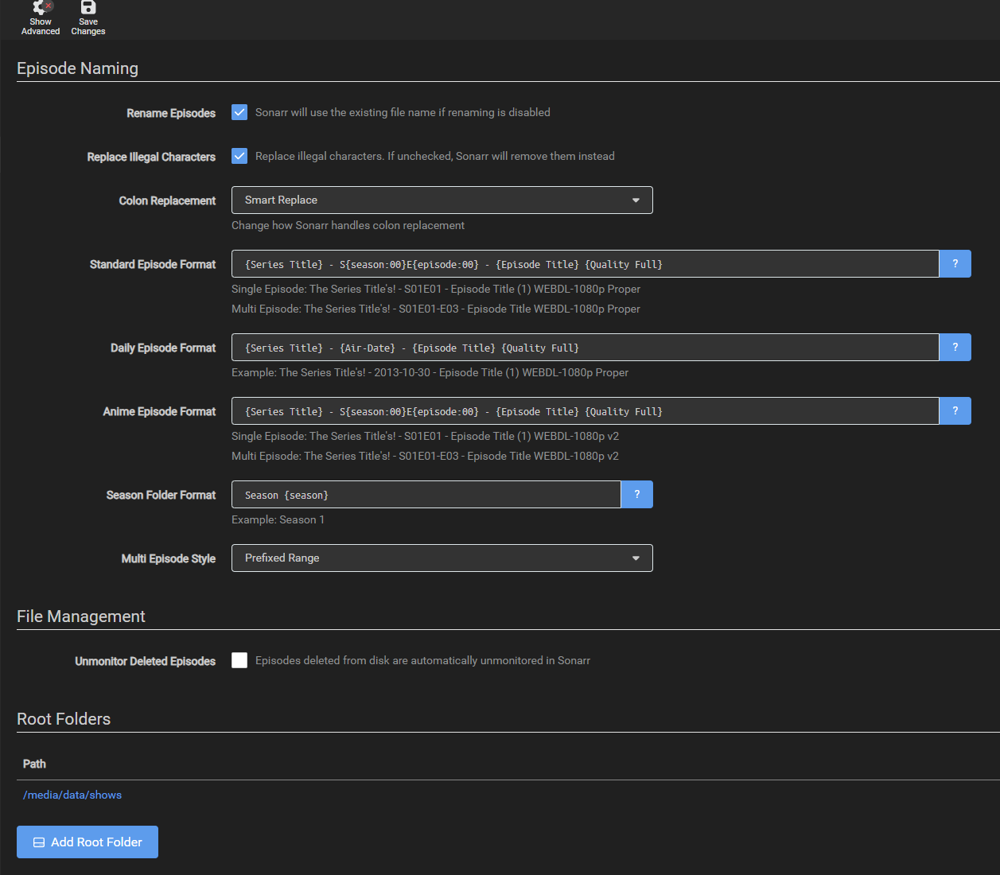

6. Se rendre sur `Settings` puis `Profiles`, puis supprimez tous les profils prédéfinis.

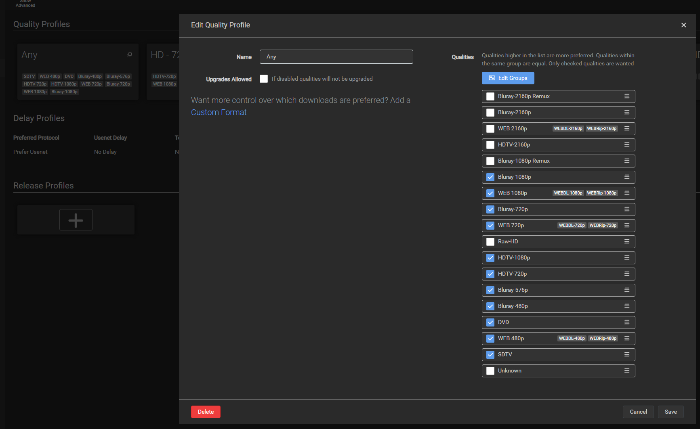

7. Créez votre propre profil selon vos souhaits. Pour ma part, je vais préférer le 1080p avec cette configuration. Vous pouvez réordonner les qualités. L'outil téléchargera la meilleure qualité disponible selon vos critères et si un nouveau torrent est disponible dans une qualité supérieure, alors il l'a récupérera automatiquement jusqu'à la limite que vous avez définie. Veillez à sélectionner votre langue, ici French.

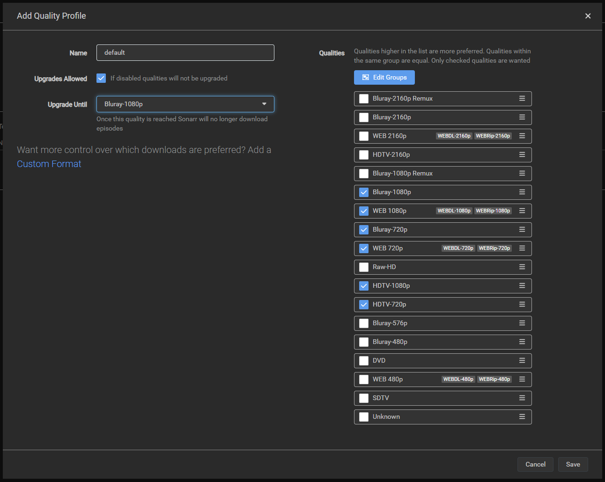

8. Se rendre sur `Settings` puis `Download Clients`, cliquez sur le bouton pour ajouter un client puis sélectionnez `Deluge`. Configurez le ainsi puis utilisez le bouton `Test` pour vérifier.

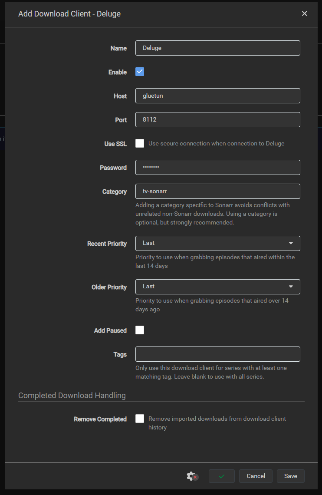

# 5. Radarr

_Cette étape va être très proche de Sonarr, je ne vais donc ajouter de capture d'écran que lorsque nécessaire._

1. Se rendre sur http://localhost:7878 et configurez l'authentification de la même manière que pour Prowlarr.

2. Se rendre dans `Settings` puis `General`. Désactivez l'envoie des données anonymes et récupérez votre clé API.

3. Sur Prowlarr, se rendre sur `Settings` puis `Apps`. Cliquez sur le bouton pour ajouter une application, sélectionnez `Radarr`. Remplissez le formulaire comme sur la capture.

```
Prowlarr server: http://gluetun:9696
Radarr server: http://radarr:7878
API Key : votre clé API Radarr
```

4. Sur Radarr, sur la page `Settings` puis `Indexers`, vous devriez maintenant voir votre indexer configuré sur Prowlarr. Si ce n'est pas le cas, vérifiez les étapes précédentes.

5. Se rendre sur `Settings` puis `Media Management`, puis configurez selon votre souhait. Je vous suggère la configuration suivante. Attention : n'oubliez pas la section `Root folders`, précisez bien le dossier où seront enregistrées vos séries. Si le dossier n'existe pas encore, créez le.

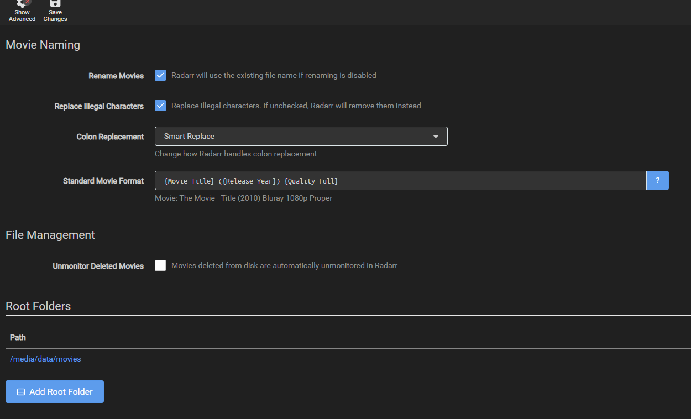

6. Se rendre sur `Settings` puis `Profiles`, puis supprimez tous les profils prédéfinis.

7. Créez votre propre profil selon vos souhaits. Pour ma part, je vais préférer le 1080p avec cette configuration. Vous pouvez réordonner les qualités. L'outil téléchargera la meilleure qualité disponible selon vos critères et si un nouveau torrent est disponible dans une qualité supérieure, alors il l'a récupérera automatiquement jusqu'à la limite que vous avez définie.

8. Se rendre sur `Settings` puis `Download Clients`, cliquez sur le bouton pour ajouter un client puis sélectionnez `Deluge`. Configurez le ainsi puis utilisez le bouton `Test` pour vérifier.

# 6. Lidarr

_Cette étape va être très proche de Sonarr, je ne vais donc ajouter de capture d'écran que lorsque nécessaire._

1. Se rendre sur http://localhost:8686 et configurez l'authentification de la même manière que pour Prowlarr.

2. Se rendre dans `Settings` puis `General`. Désactivez l'envoie des données anonymes et récupérez votre clé API.

3. Sur Prowlarr, se rendre sur `Settings` puis `Apps`. Cliquez sur le bouton pour ajouter une application, sélectionnez `Lidarr`. Remplissez le formulaire comme sur la capture.

```
Prowlarr server: http://gluetun:9696
Lidarr server: http://lidarr:8686
API Key : votre clé API Lidarr
```

4. Sur Radarr, sur la page `Settings` puis `Indexers`, vous devriez maintenant voir votre indexer configuré sur Prowlarr. Si ce n'est pas le cas, vérifiez les étapes précédentes.

5. Se rendre sur `Settings` puis `Media Management`, puis configurez selon votre souhait. Je vous suggère la configuration suivante. Attention : n'oubliez pas la section `Root folders`, précisez bien le dossier où seront enregistrées vos séries. Si le dossier n'existe pas encore, créez le.

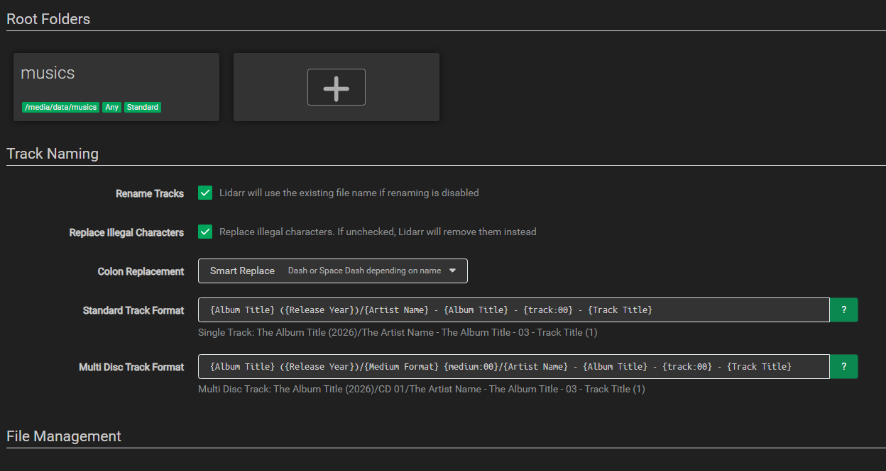

6. Se rendre sur `Settings` puis `Profiles`, puis supprimez tous les profils prédéfinis.

7. Créez votre propre profil selon vos souhaits. Pour ma part, je vais préférer le 1080p avec cette configuration. Vous pouvez réordonner les qualités. L'outil téléchargera la meilleure qualité disponible selon vos critères et si un nouveau torrent est disponible dans une qualité supérieure, alors il l'a récupérera automatiquement jusqu'à la limite que vous avez définie.

8. Se rendre sur `Settings` puis `Download Clients`, cliquez sur le bouton pour ajouter un client puis sélectionnez `Deluge`. Configurez le ainsi puis utilisez le bouton `Test` pour vérifier.

# 7. Plex

1. Se rendre sur http://localhost:32400/web, connectez vous (ou créer un compte si besoin) puis suivez le guide d'installation.

2. Configurez vos bibliothèques comme suit :

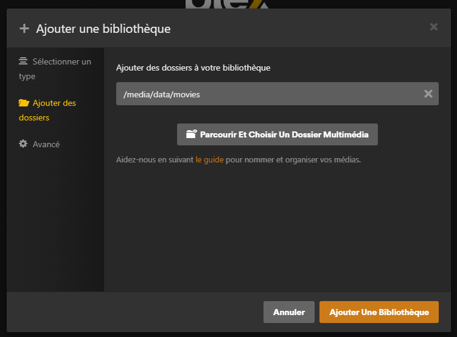

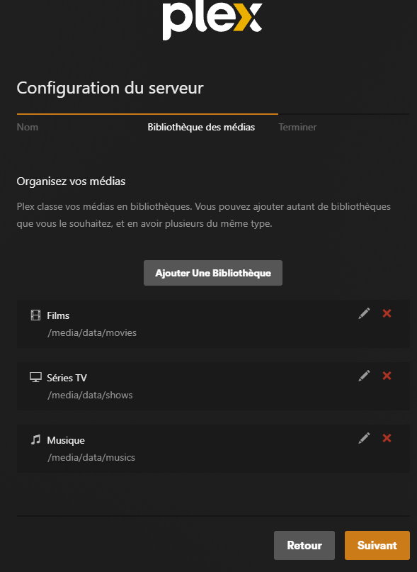

_On reviendra sur Plex plus tard._

# 8. Seerr

1. Se rendre sur http://localhost:5055/setup puis suivez le guide.

2. Sélectionnez `Plex` > `Configure Plex` > Login with Plex.

3. Cliquez sur le bouton `refresh 🔄️` à droite du champ server, puis sélectionner votre serveur ajouté précédemment.

4. Save changes

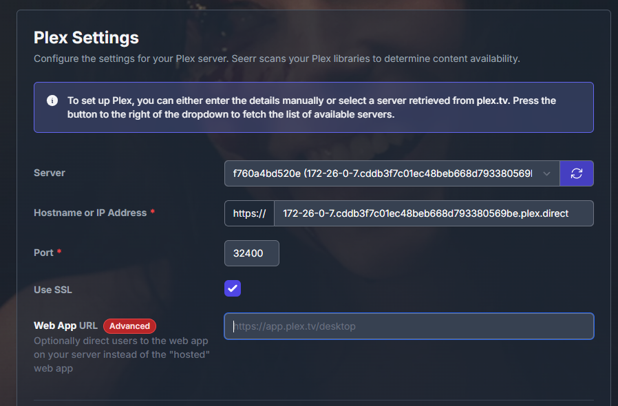

5. Cochez les bibliothèques que vous souhaitez gérer avec Seerr (films et séries)

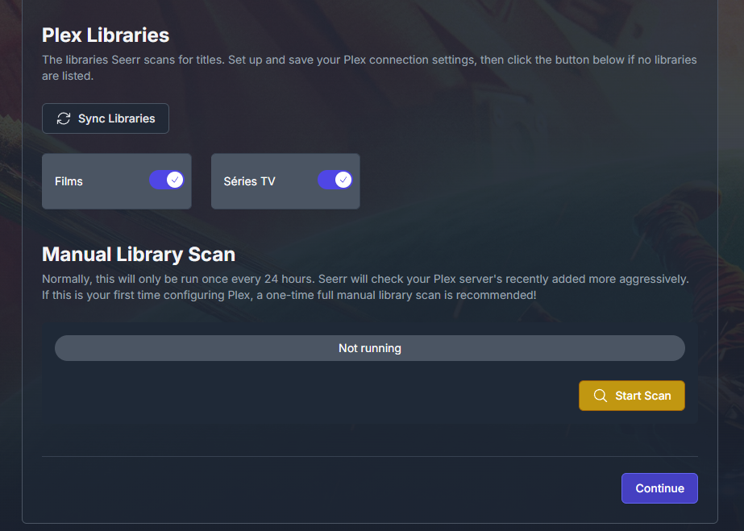

6. Start Scan, puis Continue

7. Pour l'écran suivant, vous devrez configurer Radarr et Sonarr. Beaucoup des configurations à saisir ont déjà été saisies sur la configuration avec Prowlarr, n'hésitez pas à y retourner au besoin.

**Radarr :**

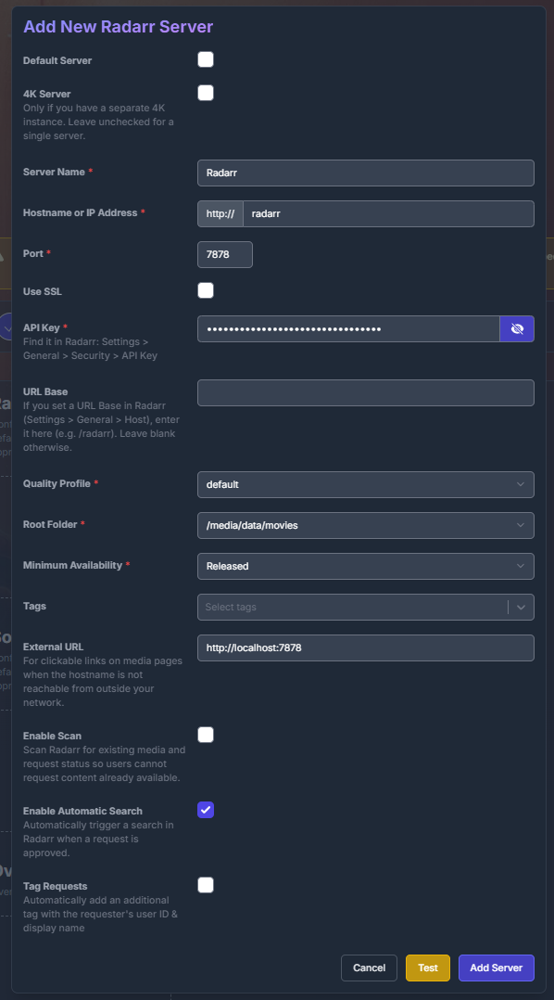

**Sonarr :**

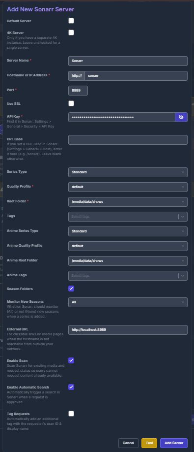

8. Finish setup

**A ce stade, vous pouvez commencer à utiliser votre stack. Parcourez Seerr pour trouver ce que vous voulez regarder, faites une demande et observez Seerr passer l'ordre à Sonarr ou Radarr qui fera automatiquement le téléchargement pour vous**

Par exemple, je choisi de télécharger The Matrix

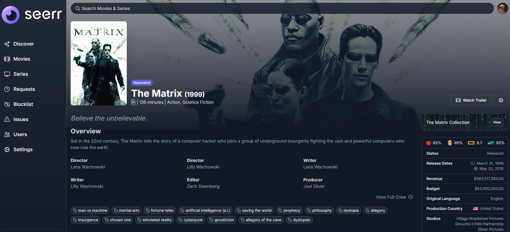

Je le retrouve dans Radarr

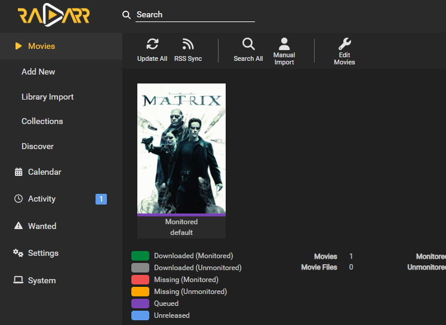

Deluge télécharge bien le fichier

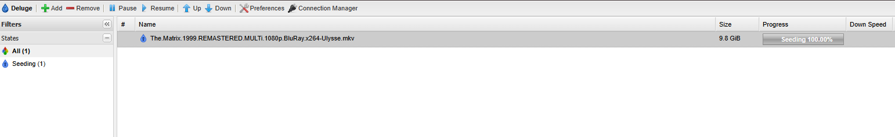

Puis il le déplace et renomme correctement

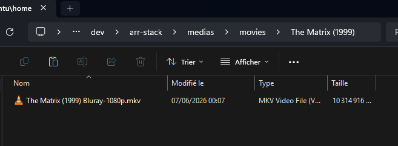

Puis je le retrouve bien dans Plex

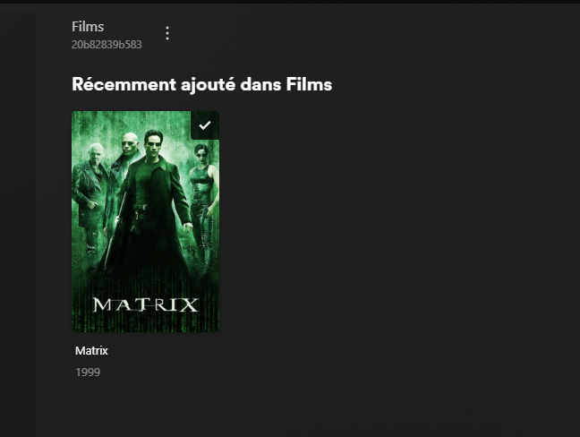

Et on profite

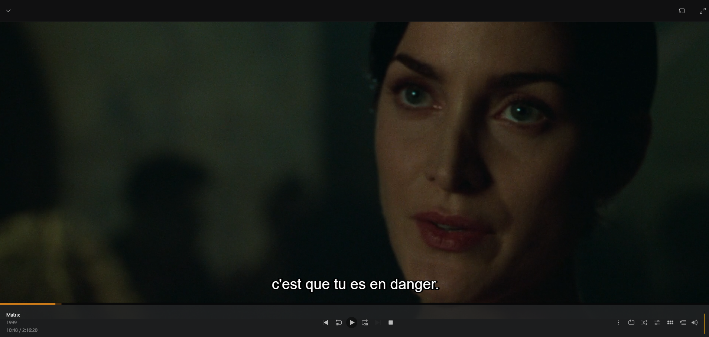

# Rappels

## Torrents

Si vous utilisez un fournisseur de torrent avec Ratio, vous devrez conserver vos torrent en seed afin de faire augmenter votre ratio et rendre service à la communauté. Il est donc vivement conseillé de garder tout vos torrents actifs le plus de temps possible et donc de laisser tourner votre serveur tout le temps. Plus vous aurez de torrent actifs plus vous gagnerez de ratio.

Télécharger du contenu que vous ne possédez pas est illégal. Le faire vous expose à des risques, c'est pourquoi l'utilisation d'un VPN est plus qu'encouragée. Privilégiez un service qui propose du port forwarding sinon vous ne pourrez que très peu seed.

## Hardware

Le mieux est d'utiliser un NAS pour installer cette solution, mais un Raspberry PI peut très bien faire le taf. J'ai moi même utilisé un Raspberry PI 4 puis un 5 pendant de longues années avant de passer récemment sur un NAS Ugreen.

Il est tout à fait possible de ne faire tourner que Plex sur le NAS et le reste sur un autre périphérique de votre réseau. Vous devrez configurer les points de montages en conséquences, mais si vous en êtes a ce stade je suppose que vous n'avez pas besoin de guide.
